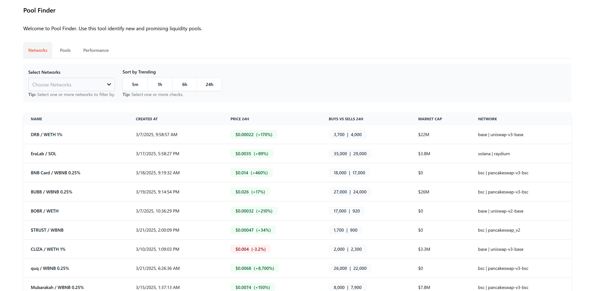

# Liquidity Pool Finder - Sveltekit UI

This tool uses the CoinGecko Megafilter API Endpoint to find, sort and filter Liquidity Pools across multiple Chains and Dexes.

### Getting Started
1. Rename `.env.example` to `.env`
2. Paste in your CG API KEY
3. Install deps `npm i`
4. Run `npm run dev`
5. Interact with the table on localhost

